# Continous Authentication Using Siamese Networks and One Class SVM

Hi this notebook goes through the process of training a siamese network to detect user from others. The data used is the gyroscope data from the UCI HAR dataset. The data is preprocessed and then fed into a siamese network. The siamese network is then used to train a one class SVM to detect the user from others. The one class SVM is then used to detect the user from others in real time. The data is then visualized using t-SNE.

## Data

The data used is the gyroscope data from the UCI HAR dataset. The data is preprocessed and then fed into a siamese network. The siamese network is then used to train a one class SVM to detect the user from others. The one class SVM is then used to detect the user from others in real time. The data is then visualized using t-SNE.

## Siamese Network

The siamese network is a neural network that takes two inputs and outputs a similarity score. The similarity score is then used to train a one class SVM to detect the user from others. The siamese network is trained using the contrastive loss function. The contrastive loss function is used to train the siamese network to output a similarity score of 0 for two inputs that are the same and a similarity score of 1 for two inputs that are different. The siamese network is trained using the contrastive loss function. The contrastive loss function is used to train the siamese network to output a similarity score of 0 for two inputs that are the same and a similarity score of 1 for two inputs that are different.

## One Class SVM

The one class SVM is a machine learning algorithm that is used to detect anomalies. 

### Results

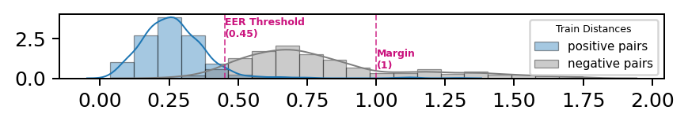

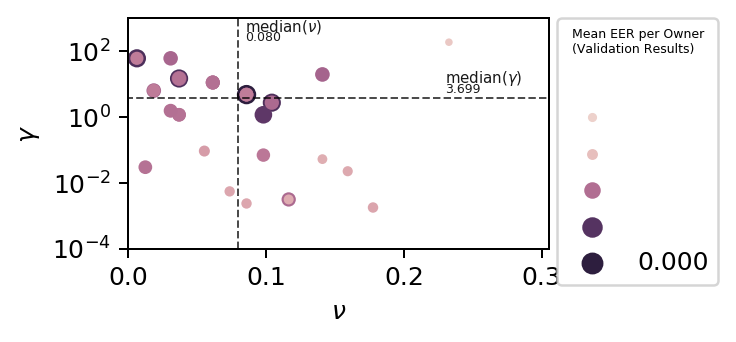
    
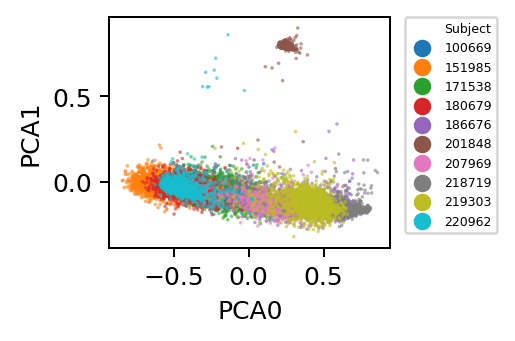
    
```python
# Standard
from pathlib import Path
import os

.. libraries for data manipulation
```

    Using TensorFlow backend.
    


```python
# utility function to generate cross-validation scenarios for training saimese network 
# Full code can be found in Training_siamese_OCSVM_HMOG_.ipynb 
def utils_generate_cv_scenarios(df_ocsvm_train_valid,samples_per_subject_train,
def utils_generate_deep_features(df, model, variant):
  
def utils_cv_report(random_search, owner, impostors):
    """Transform the random_search.cv_results_ into nice formatted dataframe."""
    
def utils_create_cv_splits(cv_mask, seed):
    """"Create cross-validation mask with train-valid pairs.
    
    See e.g. https://stackoverflow.com/a/37591377
    
    Arguments:
        cv_mask {np.ndarray} --
        
    Return:
        {list} -- List of tuple: (<train indices>, <valid indices>)
        
    """
    
    
def utils_plot_randomsearch_results(df_results, n_top=1):
    # Prepare data for plotting
   
def build_pairs(df,samples_per,seed):
    
```

# Initialize window size and model varient 


```python
from google.colab import drive
drive.mount('/content/drive')
```

    Drive already mounted at /content/drive; to attempt to forcibly remount, call drive.mount("/content/drive", force_remount=True).
    


```python
#Read preprocessed files
sess_type='_Map'
hmog='HMOG_'
#WINDOW SIZE 
window_size=500
### Choose Model Varient ###
model_variant='2d'
#importing raw data bot dataframe and array
df_siamese_train = pd.read_pickle(f"/content/drive/My Drive/H-MOG Dataset/Hmog preprocessed files/{hmog}df_train_valid_{window_size}{sess_type}")
fil_y=f'/content/drive/My Drive/H-MOG Dataset/Hmog preprocessed files/{hmog}label_X_train_val_acc_gr_{window_size}{sess_type}.txt'
file_x=f'/content/drive/My Drive/H-MOG Dataset/Hmog preprocessed files/{hmog}X_train_val_acc_gr_{window_size}{sess_type}.txt'
detail_file=f'/content/drive/My Drive/H-MOG Dataset/Hmog preprocessed files/{hmog}data_details_{window_size}{sess_type}.txt'
### Read the array from disk
new_data = np.loadtxt(file_x)
data_labels=np.loadtxt(fil_y)
details=np.loadtxt(detail_file,delimiter=',',dtype=int)
#load details
n_windows=details[0]
min_window=details[2]
# original shape of the array
new_data = new_data.reshape((n_windows,window_size,6))
# Note that this returned a 2D array!
print (new_data.shape,min_window)

df_siamese_train # not scaled (RAW)
```

    (7044, 500, 6) 425
    


<div>
<style scoped>
    .dataframe tbody tr th:only-of-type {
        vertical-align: middle;
    }

    .dataframe tbody tr th {
        vertical-align: top;
    }

    .dataframe thead th {
        text-align: right;
    }
</style>
<table border="1" class="dataframe">
  <thead>
    <tr style="text-align: right;">
      <th></th>
      <th>X</th>
      <th>subject</th>
      <th>session</th>
      <th>task_type</th>
    </tr>
  </thead>
  <tbody>
    <tr>
      <th>0</th>
      <td>[[1.1474211, -2.3852234, 10.685322, 0.08216137...</td>
      <td>100669</td>
      <td>Map</td>
      <td>1</td>
    </tr>
    <tr>
      <th>1</th>
      <td>[[0.581791, 3.5224693, 8.643068, 0.14966199, 0...</td>
      <td>100669</td>
      <td>Map</td>
      <td>1</td>
    </tr>
    <tr>
      <th>2</th>
      <td>[[1.3084313, 4.209605000000001, 6.779182000000...</td>
      <td>100669</td>
      <td>Map</td>
      <td>1</td>
    </tr>
    <tr>
      <th>3</th>
      <td>[[-0.11432313, 4.7016134, 7.9307933, 0.1237002...</td>
      <td>100669</td>
      <td>Map</td>
      <td>1</td>
    </tr>
    <tr>
      <th>4</th>
      <td>[[0.38486794, 1.5472529, 10.3214035, -0.324064...</td>
      <td>100669</td>
      <td>Map</td>
      <td>1</td>
    </tr>
    <tr>
      <th>...</th>
      <td>...</td>
      <td>...</td>
      <td>...</td>
      <td>...</td>
    </tr>
    <tr>
      <th>7039</th>
      <td>[[-0.84335756, 1.685518, 10.113108, -0.0781907...</td>
      <td>220962</td>
      <td>Map</td>
      <td>1</td>
    </tr>
    <tr>
      <th>7040</th>
      <td>[[-1.0959458, 2.6605566, 9.498994999999999, -0...</td>
      <td>220962</td>
      <td>Map</td>
      <td>1</td>
    </tr>
    <tr>
      <th>7041</th>
      <td>[[0.19153613, 1.3186066, 11.035474, 0.11545353...</td>
      <td>220962</td>
      <td>Map</td>
      <td>1</td>
    </tr>
    <tr>
      <th>7042</th>
      <td>[[-0.8074445, 1.2797008, 10.21965, 0.19853121,...</td>
      <td>220962</td>
      <td>Map</td>
      <td>1</td>
    </tr>
    <tr>
      <th>7043</th>
      <td>[[0.65421563, 1.9871874, 10.355521000000001, 0...</td>
      <td>220962</td>
      <td>Map</td>
      <td>1</td>
    </tr>
  </tbody>
</table>
<p>7044 rows × 4 columns</p>
</div>


```python
len(new_data),data_labels
```


    (7044, array([100669., 100669., 100669., ..., 220962., 220962., 220962.]))


```python
#split data into pairs
samples_per=math.ceil(min_window*.8)
sample_per_val=min_window
SEED=2020
# Reduce observations/samples per
print("Sample per session before reduction:\n ")
display(df_siamese_train["subject"].value_counts().head(3))
df_siamese_val=df_siamese_train
df_siamese_train = df_siamese_train.groupby("subject", group_keys=False).apply(
    lambda x: x.sample(n=min(len(x), samples_per), random_state=SEED)
)

print("\n\nSample per session after reduction:\n")
display(df_siamese_train["subject"].value_counts().head(3))


df_siamese_train_pairs = build_pairs(df_siamese_train,samples_per,SEED)
df_siamese_valid_pairs = build_pairs(df_siamese_val,sample_per_val,SEED-2)


print("DataFrame Info:")
display(df_siamese_train_pairs.info())

print("\n\nHead:")
display(df_siamese_train_pairs.head(5))

print("\n\nAny NaN values?")
display(df_siamese_train_pairs.isnull().sum(axis = 0))

df_left_sub = df_siamese_train_pairs.groupby("left_subject")["left_subject"].count()
df_right_sub = df_siamese_train_pairs.groupby("right_subject")["right_subject"].count()
df_temp = pd.concat([df_left_sub, df_right_sub])

print("\n\n\nDistribution of Samples per Subjects in training Data")

fig, axes = plt.subplots(
    ncols=2, nrows=1, figsize=(5.473, 2), dpi=180, gridspec_kw={"width_ratios": [1, 5]}
)
df_siamese_train_pairs["label"].value_counts().rename(
    index={0: "Negative\nPairs", 1: "Positive\nPairs"}
).plot.bar(ax=axes[0], rot=0, color=MAGENTA)
axes[0].tick_params(axis="x", which="major", pad=7)
df_temp.groupby(df_temp.index).sum().plot.bar(ax=axes[1], width=0.6)
fig.tight_layout()


```

    Sample per session before reduction:
     
    


    171538    1042
    218719     966
    207969     782
    Name: subject, dtype: int64


    
    
    Sample per session after reduction:
    
    


    180679    340
    207969    340
    220962    340
    Name: subject, dtype: int64


    DataFrame Info:
    <class 'pandas.core.frame.DataFrame'>
    RangeIndex: 1700 entries, 0 to 1699
    Data columns (total 9 columns):
    left_X             1700 non-null object
    left_subject       1700 non-null object
    left_session       1700 non-null object
    left_task_type     1700 non-null int64
    right_X            1700 non-null object
    right_subject      1700 non-null object
    right_session      1700 non-null object
    right_task_type    1700 non-null int64
    label              1700 non-null int64
    dtypes: int64(3), object(6)
    memory usage: 119.7+ KB
    

    /usr/local/lib/python3.6/dist-packages/ipykernel_launcher.py:53: FutureWarning: The join_axes-keyword is deprecated. Use .reindex or .reindex_like on the result to achieve the same functionality.
    /usr/local/lib/python3.6/dist-packages/ipykernel_launcher.py:76: FutureWarning: The join_axes-keyword is deprecated. Use .reindex or .reindex_like on the result to achieve the same functionality.
    


    None


    
    
    Head:
    


<div>
<style scoped>
    .dataframe tbody tr th:only-of-type {
        vertical-align: middle;
    }

    .dataframe tbody tr th {
        vertical-align: top;
    }

    .dataframe thead th {
        text-align: right;
    }
</style>
<table border="1" class="dataframe">
  <thead>
    <tr style="text-align: right;">
      <th></th>
      <th>left_X</th>
      <th>left_subject</th>
      <th>left_session</th>
      <th>left_task_type</th>
      <th>right_X</th>
      <th>right_subject</th>
      <th>right_session</th>
      <th>right_task_type</th>
      <th>label</th>
    </tr>
  </thead>
  <tbody>
    <tr>
      <th>0</th>
      <td>[[-0.9995792, 5.1942205, 7.508815299999999, -0...</td>
      <td>219303</td>
      <td>Map</td>
      <td>1</td>
      <td>[[-0.25139117, 4.0150760000000005, 7.9541364, ...</td>
      <td>180679</td>
      <td>Map</td>
      <td>1</td>
      <td>0</td>
    </tr>
    <tr>
      <th>1</th>
      <td>[[-0.9175778, 3.5529952000000007, 7.8146744, 0...</td>
      <td>219303</td>
      <td>Map</td>
      <td>1</td>
      <td>[[0.4189853, 3.5829230000000005, 9.138668, -0....</td>
      <td>180679</td>
      <td>Map</td>
      <td>1</td>
      <td>0</td>
    </tr>
    <tr>
      <th>2</th>
      <td>[[4.56694, -0.65301853, 8.644864, 0.39736784, ...</td>
      <td>201848</td>
      <td>Map</td>
      <td>1</td>
      <td>[[4.4663835, 0.08918401599999999, 8.001422, -0...</td>
      <td>201848</td>
      <td>Map</td>
      <td>1</td>
      <td>1</td>
    </tr>
    <tr>
      <th>3</th>
      <td>[[-0.1388637, 4.1665095999999995, 8.27496, -0....</td>
      <td>207969</td>
      <td>Map</td>
      <td>1</td>
      <td>[[-1.1438298, 3.8259343999999995, 7.9098440000...</td>
      <td>151985</td>
      <td>Map</td>
      <td>1</td>
      <td>0</td>
    </tr>
    <tr>
      <th>4</th>
      <td>[[0.88046765, 4.420893700000001, 7.82784199999...</td>
      <td>207969</td>
      <td>Map</td>
      <td>1</td>
      <td>[[-0.21368249999999997, 4.6279917, 7.969699, -...</td>
      <td>207969</td>
      <td>Map</td>
      <td>1</td>
      <td>1</td>
    </tr>
  </tbody>
</table>
</div>


    
    
    Any NaN values?
    


    left_X             0
    left_subject       0
    left_session       0
    left_task_type     0
    right_X            0
    right_subject      0
    right_session      0
    right_task_type    0
    label              0
    dtype: int64


    
    
    
    Distribution of Samples per Subjects in training Data
    


    
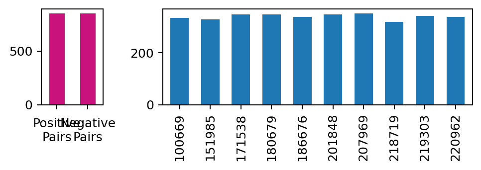
    


```python
# Distance Function
def k_euclidean_dist(t):
    x = t[0]
    y = t[1]    
    return K.sqrt(K.sum(K.square(x - y), axis=-1, keepdims=True))
#Loss Function
def k_contrastive_loss(y_true, dist):
    """Contrastive loss from Hadsell-et-al.'06
    http://yann.lecun.com/exdb/publis/pdf/hadsell-chopra-lecun-06.pdf
    """
    margin = 1
    return K.mean(y_true * K.square(dist) + (1 - y_true) * K.square(K.maximum(margin - dist, 0)))
def b_init(shape,name=None):
    """Initialize bias as in paper"""
    values=rng.normal(loc=0.5,scale=1e-2,size=shape)
    return K.variable(values,name=name)
# build siamese network 
def build_model_1d(input_shape, filters):
    """
        Model architecture
    """
    # Define the tensors for the two input images
    left_inputs = Input(input_shape, name="left_inputs")
    right_inputs = Input(input_shape, name="right_inputs")

    # Convolutional Neural Network
    inputs = Input(input_shape, name="input")
    x = Conv1D(filters[0], 11, activation="elu", padding="same", name="conv1")(inputs)
    x = MaxPooling1D(pool_size=2, name="mp1")(x)
    x = Conv1D(filters[1], 5, activation="elu", padding="same", name="conv2")(x)
    x = MaxPooling1D(pool_size=2, name="mp2")(x)
    x = Conv1D(filters[2], 3, activation="elu", padding="same", name="conv3")(x)
    x = MaxPooling1D(pool_size=2, name="mp3")(x)
    x = Conv1D(filters[3], 3, activation="elu", padding="same", name="conv4")(x)
    x = MaxPooling1D(pool_size=2, name="mp5")(x)
    x = Flatten(name="flat")(x)

    # Generate the encodings (feature vectors) for the two images
    basemodel = Model(inputs, x, name="basemodel")

    # using same instance of "basemodel" to share weights between left/right networks
    encoded_l = basemodel(left_inputs)
    encoded_r = basemodel(right_inputs)

    # Add a customized layer to compute the absolute difference between the encodings
    distance_layer = Lambda(k_euclidean_dist, name="distance")([encoded_l, encoded_r])

    siamese_net = Model(inputs=[left_inputs, right_inputs], outputs=distance_layer)

    # return the model
    return siamese_net, basemodel
def build_model_2d(input_shape, filters):
    """
        Siamese CNN architecture with 3D input and 2D filters
    """
    # Define the tensors for the two input images
    left_inputs = Input(input_shape, name="left_inputs")
    right_inputs = Input(input_shape, name="right_inputs")

    # Convolutional Neural Network
    inputs = Input(input_shape, name="input")
    x = Conv2D(filters[0], (7, 7), padding="same", activation="tanh", name="conv1")(inputs)
    x = MaxPooling2D(pool_size=(2, 2), padding="same", name="mp1")(x)
    x = Conv2D(filters[1], (5, 5), padding="same", activation="tanh", name="conv2")(x)
    x = MaxPooling2D(pool_size=(2, 2), padding="same", name="mp2")(x)
    x = Conv2D(filters[2], (3, 3), padding="same", activation="tanh", name="conv3")(x)
    x = MaxPooling2D(pool_size=(2, 2), padding="same", name="mp3")(x)
    x = Conv2D(filters[3], (3, 3), padding="same", activation="tanh", name="conv4")(x)
    x = MaxPooling2D(pool_size=(2, 2), padding="same", name="mp4")(x)
    x = Flatten(name="flat")(x)

    # Basemodel instance
    basemodel = Model(inputs, x, name="basemodel")

    # using same instance of "basemodel" to share weights between left/right networks
    encoded_l = basemodel(left_inputs)
    encoded_r = basemodel(right_inputs)

    # Add a customized layer to compute the distance between the encodings
    distance_layer = Lambda(k_euclidean_dist, name="distance")([encoded_l, encoded_r])
    # Add a customized layer to compute the absolute difference between the encodings
    L1_layer = Lambda(lambda tensors:K.abs(tensors[0] - tensors[1]))
    L1_distance = L1_layer([encoded_l, encoded_r])
    
    prediction = Dense(1,activation='sigmoid')(L1_distance)

    n_outputs=2
    outputs = Dense(n_outputs, activation='softmax')(L1_distance)

    # Combine into one net
    siamese_net = Model(inputs=[left_inputs, right_inputs], outputs=distance_layer)

    # return the model
    return siamese_net, basemodel

# in_shape=(X_train[0].shape[1:])
# n_filters=[32, 64, 128, 64]#[64,128,256,256]
# model, basemodel  = build_model_2d(in_shape,n_filters)

# basemodel.summary()
# model.summary()


```


```python
# function to get differnet optimisers for training 
def get_optimizer(name, lr=None, decay=None):
    if name == "sgd":
        lr = lr if lr != None else 0.01
        decay = decay if decay != None else 0
        optimizer = SGD(lr=lr, decay=decay)
    elif name == "adam":
        lr = lr if lr != None else 0.001
        decay = decay if decay != None else 0
        optimizer = keras.optimizers.Adam(lr=lr, decay=decay)
    elif name == "rmsprop":
        lr = lr if lr != None else 0.001
        optimizer = RMSprop(lr=lr)
    else:
        raise BaseException("Error: Not a valid model name: 1d or 2d.")
    return optimizer
# Calculate the Equal Error Rate
def utils_eer(y_true, y_pred, return_threshold=False):
    """Calculate the Equal Error Rate.

    Based on https://stackoverflow.com/a/49555212, https://yangcha.github.io/EER-ROC/
    and https://scikit-learn.org/stable/modules/model_evaluation.html#implementing-your-own-scoring-object

    Arguments:
        y_true {np.array}  -- Actual labels
        y_pred {np.array}  -- Predicted labels or probability
        
    Returns:
        float              -- Equal Error Rate        
    """
    fpr, tpr, thresholds = roc_curve(y_true, y_pred, pos_label=1)
    eer = brentq(lambda x: 1.0 - x - interp1d(fpr, tpr)(x), 0.0, 1.0)
    thresh = interp1d(fpr, thresholds)(eer)  # Calculated threshold, not needed for score
    if return_threshold:
        return eer, thresh
    else:
        return eer
def utils_save_plot(fig, filepath):
    """Save plot to file using certain layout and dpi."""
    fig.savefig(filepath, bbox_inches="tight", pad_inches=0.01, dpi=600)

def utils_plot_training_loss(history):
    MAGENTA = (202/255, 18/255, 125/255)
    """Plot Train/Valid Loss during Epochs."""
    fig = plt.figure(figsize=(5.473, 2.7), dpi=180)
    plt.plot(history.history["loss"], label="train", color="tab:blue")
    plt.plot(history.history["val_loss"], label="valid", color=MAGENTA)
    plt.ylabel("Loss")
    plt.xlabel("Epochs")
    plt.legend(loc="upper right")
    fig.gca().xaxis.set_major_locator(MaxNLocator(integer=True))
    fig.tight_layout()
    return plt
def utils_plot_distance_hist(dist_positive, dist_negative, thres, desc, margin=None):
    """Plot histogramm of Euclidean Distances for Positive & Negative Pairs."""
    MAGENTA = (202/255, 18/255, 125/255)

    warnings.filterwarnings("ignore")

    # Plot Distributions
    plt.figure(figsize=(5.473, 0.6), dpi=180)
    bins = np.linspace(
        min(dist_positive.min(), dist_negative.min()),
        max(dist_positive.max(), dist_negative.max()),
        num=21,
    )
    g1 = sns.distplot(
        dist_positive,
        label="positive pairs",
        bins=bins,
        axlabel=False,
        hist_kws=dict(edgecolor="k", lw=0.5),
        kde_kws=dict(linewidth=0.8),
        color="tab:blue",
    )
    g2 = sns.distplot(
        dist_negative,
        label="negative pairs",
        bins=bins,
        hist_kws=dict(edgecolor="k", lw=0.5),
        kde_kws=dict(linewidth=0.8),
        color="tab:gray",
    )

    # Plot vertical lines
    if thres > 0:
        max_y = max(g1.get_ylim()[1], g2.get_ylim()[1])
        plt.axvline(x=thres, color=MAGENTA, linestyle="--", lw=0.8, alpha=0.7)
        plt.text(
            x=thres + 0.001,
            y=max_y * 0.65,
            s=f"EER Threshold\n({thres:.2f})",
            color=MAGENTA,
            weight="bold",
            fontsize=5,
            alpha=1
        )
        if margin:
            plt.axvline(x=margin, color=MAGENTA, linestyle="--", lw=0.8, alpha=0.7)
            plt.text(
                x=margin + 0.001,
                y=max_y * 0.15,
                s=f"Margin\n({margin})",
                color=MAGENTA,
                weight="bold",
                fontsize=5,
                alpha=1
            )

    # Legend
    plt.legend(
        loc="upper right",
        title=f"{desc} Distances",
        title_fontsize=5,
        fontsize=6,
    )

    warnings.filterwarnings("default")
    return plt
class MetricsCallback(keras.callbacks.Callback):
    """
    Custom Keras Callback function.
    
    Used to predict and plot distances for positive and negative pairs
    after each n-th epoch, along with some 'classification' metrics. 
    'Classification' here means to ability to distinguish between positive 
    and negative pairs using a threshold for the distance.
    
    Arguments:
        payload {tuple}           -- Datasets used for evaluation: (X_valid, y_valid, X_train, y_train)
        epoch_evaluate_freq {int} -- Frequency for evaluation. After every n-th epoch, 
                                     the results are evaluated and printed
        save_plots {boolean}      -- Do you want to save plots as PDF? Path is configured via global
                                     parameter REPORT_PATH.
    """

    def __init__(self, payload, epoch_evaluate_freq=1, save_plots=False):

        self.X_valid, self.y_valid, self.X_train, self.y_train = payload
        self.save_plots = save_plots
        self.epoch_evaluate_freq = epoch_evaluate_freq

        # Do we have train and valid set?
        self.sets = []
        if self.X_train:
            self.sets.append([self.X_train, self.y_train, "Train"])
        if self.X_valid:
            self.sets.append([self.X_valid, self.y_valid, "Valid"])

    def on_train_begin(self, logs={}):
        print(32 * "=" + f"[ Initial State ]" + 32 * "=", end="")
        for X, y, desc in self.sets:
#             print(X[0].shape,y.shape)
            self.evaluate(X, y, logs, desc, -1)

    def on_train_end(self, logs={}):
        print(32 * "=" + f"[ Final State ]" + 32 * "=", end="")
        for X, y, desc in self.sets:
            self.evaluate(X, y, logs, desc, -1)

    def on_epoch_end(self, epoch, logs={}):
        print(32 * "=" + f"[   Epoch {epoch}   ]" + 32 * "=", end="")
        if epoch % self.epoch_evaluate_freq == 0:  # Evaluate only every n-th epoch
            for X, y, desc in self.sets:
                self.evaluate(X, y, logs, desc, epoch)
        else:
            print(f"\n{ ', '.join([k + ': ' + f'{v:.3f}' for k,v in logs.items()]) }")

    def evaluate(self, X, y, logs, desc, epoch):
        # Predict
        y_score = self.model.predict(X)
        y_score_neg = y_score * -1  # lower distance means closer to positive class

        # Calc Metrics
        roc_val = metrics.roc_auc_score(y, y_score_neg)
        eer_val, thres = utils_eer(y, y_score_neg, True)
        y_pred = np.where(y_score_neg > thres, 1, 0)
        acc_val = metrics.accuracy_score(y, y_pred)
        f1_val = metrics.f1_score(y, y_pred)
#         print(roc_val,eer_val,acc_val,f1_val)
        print(
            f"\n{desc.upper()}: roc_auc: {roc_val:.4f}, "
            + f"eer: {eer_val:.4f}, thres: {thres*-1:.4f} => "
            + f"acc: {acc_val:.4f}, f1: {f1_val:.4f}\n"
            
        )

        # Plot distances
        mask = np.where(y == 1, True, False)
        dist_positive = y_score[mask]
        dist_negative = y_score[~mask]
        plt = utils_plot_distance_hist(
            dist_positive, dist_negative, thres * -1, desc=desc, margin=1
        )

        if self.save_plots:
            utils_save_plot(
                plt,
                REPORT_PATH
                / f"buech2019-siamese-MINE-epoch-{epoch+1}-{desc.lower()}.pdf",
            )

        plt.show()
```


```python


### ###
def prep_X_y_pair(df):
    
    X_left = np.stack(list(df["left_X"].values))
    X_right = np.stack(list(df["right_X"].values))
    
    X = [X_left, X_right]
    y = df["label"].values
    
    return X, y
X_train, y_train = prep_X_y_pair(df_siamese_train_pairs)
X_valid, y_valid = prep_X_y_pair(df_siamese_valid_pairs)

# 2D Filter Model needs flat 4th dimension
if model_variant == "2d":
    X_train[0] = X_train[0].reshape((*X_train[0].shape, 1))
    X_train[1] = X_train[1].reshape((*X_train[1].shape, 1))
    X_valid[0] = X_valid[0].reshape((*X_valid[0].shape, 1))
    X_valid[1] = X_valid[1].reshape((*X_valid[1].shape, 1))


print(
    f"Training samples:   {y_train.shape[0]}, shape: {X_train[0].shape},"
    + f" class balance: {np.unique(y_train, return_counts=True)}"
)
print(
    f"Validation samples: {y_valid.shape[0]}, shape: {X_valid[0].shape},"
    + f" class balance: {np.unique(y_valid, return_counts=True)}"
)
```

    Training samples:   1700, shape: (1700, 500, 6, 1), class balance: (array([0, 1]), array([850, 850]))
    Validation samples: 2120, shape: (2120, 500, 6, 1), class balance: (array([0, 1]), array([1060, 1060]))
    


```python
optimizer = get_optimizer("adam", 0.002)
in_shape=(X_train[0].shape[1:])
n_filters=[32, 64, 128, 64]#[64,128,256,256]
#get model
if model_variant=='2d':
    model, basemodel  = build_model_2d(in_shape,n_filters)
else:
    model, basemodel  = build_model_1d(in_shape,n_filters)


# # Concat train & valid data
X_train_valid = [[], []]
X_train_valid[0] = np.vstack([X_train[0], X_valid[0]])
X_train_valid[1] = np.vstack([X_train[1], X_valid[1]])
y_train_valid = np.hstack([y_train, y_valid])

# Train
model.compile(loss=k_contrastive_loss, optimizer=optimizer)

history = model.fit(
    x=X_train_valid,
    y=y_train_valid,
    batch_size=100,
    epochs=30,
    verbose=0,
    validation_data=(X_valid, y_valid),
    callbacks=[MetricsCallback((None, None, X_train, y_train), epoch_evaluate_freq=5, save_plots=False)],
)

model.save(f'data_hapt/sia_model_-{model_variant}-{min_window}.h5')

print("Training History:")

plt = utils_plot_training_loss(history)
utils_save_plot(
    plt, f'data_hapt/{hmog}buech2019-siamese-MINE-{min_window}-{model_variant}-{hmog}-epoch-trainloss.pdf'
)
plt.show()


```

    ================================[ Initial State ]================================
    TRAIN: roc_auc: 0.7331, eer: 0.3329, thres: 1.1864 => acc: 0.6671, f1: 0.6671
    
    


    
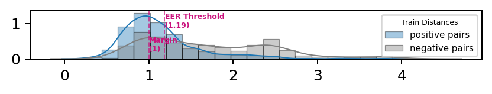
    


    ================================[   Epoch 0   ]================================
    TRAIN: roc_auc: 0.8808, eer: 0.2047, thres: 0.4975 => acc: 0.7953, f1: 0.7951
    
    


    
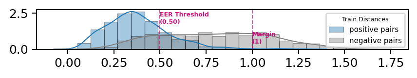
    


    ================================[   Epoch 1   ]================================
    val_loss: 0.141, loss: 0.142
    ================================[   Epoch 2   ]================================
    val_loss: 0.120, loss: 0.138
    ================================[   Epoch 3   ]================================
    val_loss: 0.154, loss: 0.137
    ================================[   Epoch 4   ]================================
    val_loss: 0.133, loss: 0.131
    ================================[   Epoch 5   ]================================
    TRAIN: roc_auc: 0.9583, eer: 0.1000, thres: 0.5039 => acc: 0.9000, f1: 0.9000
    
    


    
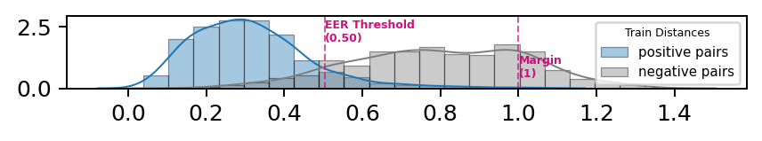
    


    ================================[   Epoch 6   ]================================
    val_loss: 0.146, loss: 0.130
    ================================[   Epoch 7   ]================================
    val_loss: 0.117, loss: 0.117
    ================================[   Epoch 8   ]================================
    val_loss: 0.150, loss: 0.139
    ================================[   Epoch 9   ]================================
    val_loss: 0.130, loss: 0.136
    ================================[   Epoch 10   ]================================
    TRAIN: roc_auc: 0.9524, eer: 0.1110, thres: 0.7252 => acc: 0.8888, f1: 0.8888
    
    


    
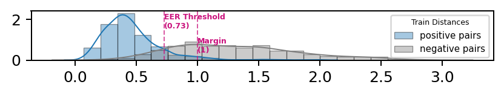
    


    ================================[   Epoch 11   ]================================
    val_loss: 0.103, loss: 0.114
    ================================[   Epoch 12   ]================================
    val_loss: 0.207, loss: 0.112
    ================================[   Epoch 13   ]================================
    val_loss: 0.112, loss: 0.141
    ================================[   Epoch 14   ]================================
    val_loss: 0.104, loss: 0.115
    ================================[   Epoch 15   ]================================
    TRAIN: roc_auc: 0.9566, eer: 0.1082, thres: 0.3809 => acc: 0.8912, f1: 0.8911
    
    


    
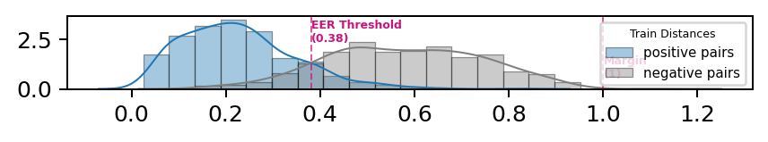
    


    ================================[   Epoch 16   ]================================
    val_loss: 0.094, loss: 0.102
    ================================[   Epoch 17   ]================================
    val_loss: 0.173, loss: 0.099
    ================================[   Epoch 18   ]================================
    val_loss: 0.097, loss: 0.112
    ================================[   Epoch 19   ]================================
    val_loss: 0.095, loss: 0.103
    ================================[   Epoch 20   ]================================
    TRAIN: roc_auc: 0.9809, eer: 0.0537, thres: 0.5674 => acc: 0.9476, f1: 0.9476
    
    


    
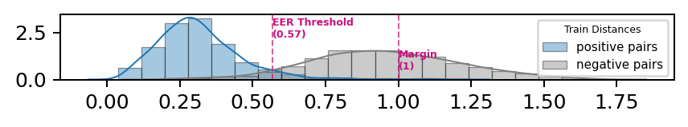
    


    ================================[   Epoch 21   ]================================
    val_loss: 0.091, loss: 0.090
    ================================[   Epoch 22   ]================================
    val_loss: 0.093, loss: 0.093
    ================================[   Epoch 23   ]================================
    val_loss: 0.096, loss: 0.092
    ================================[   Epoch 24   ]================================
    val_loss: 0.094, loss: 0.092
    ================================[   Epoch 25   ]================================
    TRAIN: roc_auc: 0.9729, eer: 0.0741, thres: 0.5275 => acc: 0.9265, f1: 0.9264
    
    


    
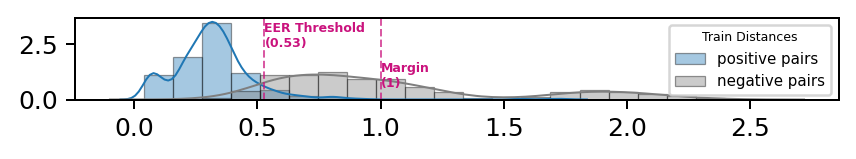
    


    ================================[   Epoch 26   ]================================
    val_loss: 0.103, loss: 0.094
    ================================[   Epoch 27   ]================================
    val_loss: 0.080, loss: 0.087
    ================================[   Epoch 28   ]================================
    val_loss: 0.155, loss: 0.088
    ================================[   Epoch 29   ]================================
    val_loss: 0.096, loss: 0.110
    ================================[ Final State ]================================
    TRAIN: roc_auc: 0.9825, eer: 0.0518, thres: 0.4510 => acc: 0.9482, f1: 0.9482
    
    


    

    


```python
# Predic validation set
dists = model.predict(X_valid)

# Stats
print(f"Mean distance: {dists.mean():.5f}")
print(f"Max distance: {dists.max():.5f}")
print(f"Min distance: {dists.min():.5f}\n")

# Histrogram
print("\nHistogram of Pair Distances:")
eer_val, thres = utils_eer(y_valid, dists, True)
mask = np.where(y_valid == 1, True, False)
dist_positive = dists[mask]
dist_negative = dists[~mask]
plt = utils_plot_distance_hist(dist_positive, dist_negative, thres, "Valid")
plt.show()
utils_save_plot(utils_plot_distance_hist(dist_positive, dist_negative, thres, "Valid"),f"sai_250_histogram_of_pairs_{window_size}_{model_variant}_{hmog}.png")
```

    Mean distance: 0.57055
    Max distance: 1.42377
    Min distance: 0.00659
    
    
    Histogram of Pair Distances:
    


    
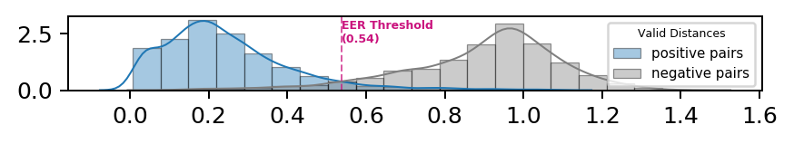
    


    

    


```python
# Extract one of the child networks
def load_deep_feature_model(model_path):
    warnings.filterwarnings("ignore")  # Silence depr. warnings

    # Copy of function from above. It's just more convenient for partially executing the notebook.
    def k_contrastive_loss(y_true, dist):
        """Contrastive loss from Hadsell-et-al.'06
        http://yann.lecun.com/exdb/publis/pdf/hadsell-chopra-lecun-06.pdf
        """
        margin = 1
        return K.mean(
            y_true * K.square(dist)
            + (1 - y_true) * K.square(K.maximum(margin - dist, 0))
        )

    # Load Trained Siamese Network
    model = load_model(
        model_path,
        custom_objects={"k_contrastive_loss": k_contrastive_loss},
    )

    # Extract one of the child networks
    deep_feature_model = Model(
        inputs=model.get_input_at(0),  # get_layer("left_inputs").input,
        outputs=model.get_layer("basemodel").get_output_at(1),
    )

    return deep_feature_model

model=load_deep_feature_model(f'data_hapt/sia_model_-{model_variant}-{min_window}.h5')
deep_feature_model = Model(
        inputs=model.get_input_at(0),  # get_layer("left_inputs").input,
        outputs=model.get_layer("basemodel").get_output_at(1),
    )
deep_feature_model.summary()
#
```

    Model: "model_3"
    _________________________________________________________________
    Layer (type)                 Output Shape              Param #   
    =================================================================
    left_inputs (InputLayer)     (None, 128, 6, 1)         0         
    _________________________________________________________________
    basemodel (Model)            (None, 512)               200512    
    =================================================================
    Total params: 200,512
    Trainable params: 200,512
    Non-trainable params: 0
    _________________________________________________________________
    


```python

# #for one feture 
# new_new_data=new_data[:,:,0]
# print(new_new_data.shape)
def get_data(new_data,data_labels,min_window):
    win_sz=new_data.shape[1]
    x_train=np.zeros([1,win_sz,6])#36 windows 
    y_train=np.zeros([1])
    x_test=np.zeros([1,win_sz,6])#9 windows
    y_test=np.zeros([1])

    itr=0
    min_window=min_window

    train_idx=floor(min_window*.8)
    test_idx=min_window
    first_user=np.unique(data_labels)[0]
    x_train=np.append(x_train,new_data[np.where(data_labels==first_user)[0][:train_idx]],axis=0)
    x_test=np.append(x_test,new_data[np.where(data_labels==first_user)[0][train_idx:test_idx]],axis=0)
    y_train=np.append(y_train,data_labels[np.where(data_labels==first_user)[0][:train_idx]],axis=0)
    y_test=np.append(y_test,data_labels[np.where(data_labels==first_user)[0][train_idx:test_idx]],axis=0)
    x_train=np.delete(x_train,0,axis=0)
    x_test=np.delete(x_test,0,axis=0)
    y_train=np.delete(y_train,0,axis=0)
    y_test=np.delete(y_test,0,axis=0)
    for u,i in enumerate(np.unique(data_labels)[1:]):
#         print(i)
        x_train=np.append(x_train,new_data[np.where(data_labels==i)[0][:train_idx]],axis=0)
        x_test=np.append(x_test,new_data[np.where(data_labels==i)[0][train_idx:test_idx]],axis=0)
        y_train=np.append(y_train,data_labels[np.where(data_labels==i)[0][:train_idx]],axis=0)
        y_test=np.append(y_test,data_labels[np.where(data_labels==i)[0][train_idx:test_idx]],axis=0)
    return x_train,y_train,x_test,y_test
def create_dataset(df):

    sequences = df.astype(np.float32).tolist()
   
        
    dataset = torch.tensor(sequences).float() 

    n_seq, seq_len, n_features = (dataset).shape

    return dataset, seq_len, n_features
#getting x train and test
x_train,y_train,x_test,y_test=get_data(new_data,data_labels,min_window)
train_dataset, seq_len, n_features = create_dataset(x_train)
val_dataset, _, _ = create_dataset(x_test)

print(x_train.shape,val_dataset.shape)
deep_features_train = None

if model_variant=='2d':
    x_train=x_train.reshape(*x_train.shape,1)
    x_test=x_test.reshape(*x_test.shape,1)
    
for i in tqdm(range(len(x_train)),total=len(x_train),leave=False,desc="Predicting on Train"): 
    X=x_train[i]
    y=int(y_train[i])
    X=X.reshape(1,*X.shape)
   
    pred = deep_feature_model.predict([X, X])
    df_features = pd.DataFrame(pred)
    df_features["subject"] = y
    deep_features_train = pd.concat([deep_features_train, df_features])
        
deep_features_test = None
for i in tqdm(range(len(x_test)),total=len(x_test),leave=False,desc="Predicting on Test"):   
    X=x_test[i]
    y=int(y_test[i])
    X=X.reshape(1,*X.shape)
    pred = deep_feature_model.predict([X, X])
    df_features = pd.DataFrame(pred)
    df_features["subject"] = y
    deep_features_test = pd.concat([deep_features_test, df_features])
        
display(len(deep_features_train))
display(deep_features_test.head(3))
deep_features_train.to_csv('')

```

    (13320, 128, 6) torch.Size([3340, 128, 6])
    


    HBox(children=(FloatProgress(value=0.0, description='Predicting on Train', max=13320.0, style=ProgressStyle(de…


    


    HBox(children=(FloatProgress(value=0.0, description='Predicting on Test', max=3340.0, style=ProgressStyle(desc…


    


    13320


<div>
<style scoped>
    .dataframe tbody tr th:only-of-type {
        vertical-align: middle;
    }

    .dataframe tbody tr th {
        vertical-align: top;
    }

    .dataframe thead th {
        text-align: right;
    }
</style>
<table border="1" class="dataframe">
  <thead>
    <tr style="text-align: right;">
      <th></th>
      <th>0</th>
      <th>1</th>
      <th>2</th>
      <th>3</th>
      <th>4</th>
      <th>5</th>
      <th>6</th>
      <th>7</th>
      <th>8</th>
      <th>9</th>
      <th>...</th>
      <th>503</th>
      <th>504</th>
      <th>505</th>
      <th>506</th>
      <th>507</th>
      <th>508</th>
      <th>509</th>
      <th>510</th>
      <th>511</th>
      <th>subject</th>
    </tr>
  </thead>
  <tbody>
    <tr>
      <th>0</th>
      <td>0.999661</td>
      <td>0.999152</td>
      <td>-0.994333</td>
      <td>0.999868</td>
      <td>-0.998411</td>
      <td>0.999204</td>
      <td>0.999692</td>
      <td>0.999252</td>
      <td>-0.991798</td>
      <td>0.999689</td>
      <td>...</td>
      <td>0.999371</td>
      <td>-0.996297</td>
      <td>-0.998729</td>
      <td>-0.998439</td>
      <td>0.999811</td>
      <td>-0.997316</td>
      <td>0.998605</td>
      <td>-0.998808</td>
      <td>0.999725</td>
      <td>100669</td>
    </tr>
    <tr>
      <th>0</th>
      <td>0.999655</td>
      <td>0.999220</td>
      <td>-0.993886</td>
      <td>0.999873</td>
      <td>-0.998492</td>
      <td>0.999269</td>
      <td>0.999752</td>
      <td>0.999212</td>
      <td>-0.992089</td>
      <td>0.999711</td>
      <td>...</td>
      <td>0.999397</td>
      <td>-0.996221</td>
      <td>-0.998754</td>
      <td>-0.998386</td>
      <td>0.999811</td>
      <td>-0.997324</td>
      <td>0.998597</td>
      <td>-0.998798</td>
      <td>0.999720</td>
      <td>100669</td>
    </tr>
    <tr>
      <th>0</th>
      <td>0.999681</td>
      <td>0.999235</td>
      <td>-0.993839</td>
      <td>0.999865</td>
      <td>-0.998501</td>
      <td>0.999292</td>
      <td>0.999789</td>
      <td>0.999215</td>
      <td>-0.992280</td>
      <td>0.999728</td>
      <td>...</td>
      <td>0.999379</td>
      <td>-0.996362</td>
      <td>-0.998697</td>
      <td>-0.998454</td>
      <td>0.999808</td>
      <td>-0.997386</td>
      <td>0.998528</td>
      <td>-0.998744</td>
      <td>0.999708</td>
      <td>100669</td>
    </tr>
  </tbody>
</table>
<p>3 rows × 513 columns</p>
</div>


```python
from sklearn.decomposition import PCA
import seaborn as sns

def plot_pca(df):
    # PCA
    pca = PCA(n_components=2)
    deep_transformed = pca.fit_transform(df.drop(columns=["subject"]).values)

    # Create df with data needed for chart only
    df_viz = df.copy()
    df_viz["PCA0"] = deep_transformed[:, 0]
    df_viz["PCA1"] = deep_transformed[:, 1]
    df_viz.drop(
        columns=[c for c in df_viz.columns if c not in ["PCA0", "PCA1", "subject"]]
    )

    # Generate color index for every subject
    df_viz["Subject"] = pd.Categorical(df_viz["subject"])
    df_viz["colors"] = df_viz["Subject"].cat.codes

    if len(df_viz["Subject"].unique()) <= 10:
        pal = sns.color_palette("tab10")
    else:
        pal = sns.color_palette("husl", 30)
        
    # Actual plot
    fig = plt.figure(figsize=(3, 2), dpi=180)
    sns.scatterplot(
        x="PCA0",
        y="PCA1",
        data=df_viz,
        hue="Subject",
        legend="full",
        palette=pal,
        s=2,
        linewidth=0,
        alpha=0.6,
    )
    plt.legend(bbox_to_anchor=(1.05, 1), loc=2, borderaxespad=0, fontsize=5)
    fig.tight_layout()
    return plt
plot_pca(deep_features_train)


```


    <module 'matplotlib.pyplot' from '/cs/home/khfy6uat/.virtualenv/lib64/python3.6/site-packages/matplotlib/pyplot.py'>


    

    


## saimese as a classifier 


```python

```


```python
# test if owner or not
def isit(dist,dist_owner):
    su=0
    for i in dist_owner:
        if all( i < dist):
            su=su+1
#     print(su)
    return su
        

```


```python
deep_features=deep_features_train
def test_thresh(deep_features_train,thres):
    best_all=np.empty(0)
    min_all=np.empty(0)

    best_all_owner=np.empty(0)
    min_all_owner=np.empty(0)


    avg_dist_owner_all=np.empty(0)
    avg_dist_all=np.empty(0)

    n_imposters=45#number of imposters to test against 
    n_owner=30

    for i,sub in tqdm(enumerate(deep_features["subject"].unique()),total=len((deep_features["subject"].unique())),leave=False,desc="Owner"):
#         print(sub)
        train_sample=deep_features.query("subject==@sub").sample(n=n_owner).drop(columns=['subject']).to_numpy()
        res=np.empty(0)
        res_owner=np.empty(0)
        avg_dist_owner=np.empty(0)
        avg_dist=np.empty(0)
        for idx,a in enumerate(train_sample):# for imposters 
            count=0
#             print(f"testing with subject: {sub} samples no: {idx}")
            test_sample=deep_features.query("subject!=@sub").sample(n=n_imposters).drop(columns=['subject']).to_numpy()
            test_sample_owner=deep_features.query("subject==@sub").sample(n=n_owner).drop(columns=['subject']).to_numpy()

            z,c=a,test_sample_owner
            x,y=a,test_sample

            dist=np.sqrt(np.sum(np.square(x - y), axis=-1, keepdims=True))
            dist_owner=np.sqrt(np.sum(np.square(z - c), axis=-1, keepdims=True))

            avg_dist_owner=np.append(avg_dist_owner,dist_owner.mean())
            avg_dist=np.append(avg_dist,dist.mean())

            got_true=int(sum(dist>thres))
            got_true_owner=int(sum(dist_owner<thres))

            res=np.append(res,got_true)
            res_owner=np.append(res_owner,got_true_owner)

#             print(f'Got {got_true} out of {n}')
    
#         print(f'##best for subject {sub} is {res.argmax()} with a score of {res.max()}  ({(res.max()/n)*100}%)##')
#         print(f'##MIN for subject {sub} is {res.argmin()} with a score of {res.min()}  ({(res.min()/n)*100})##')

#         print(f'##best SELF! for subject {sub} is {res_owner.argmax()} with a score of {res_owner.max()}  ({(res_owner.max()/n_o)*100}%)##')
#         print(f'##MIN SELF! for subject {sub} is {res_owner.argmin()} with a score of {res_owner.min()}  ({(res_owner.min()/n_o)*100})##')

#         print(f'AvERage dist : {avg_dist.mean()}')
#         print(f'AvERage dist OWNER: {avg_dist_owner.mean()}')


        best_all=np.append(best_all,res.max())
        min_all=np.append(min_all,res.min())

        best_all_owner=np.append(best_all_owner,res_owner.max())
        min_all_owner=np.append(min_all_owner,res_owner.min())

        avg_dist_all=np.append(avg_dist_all,avg_dist.mean())
        avg_dist_owner_all=np.append(avg_dist_owner_all,avg_dist_owner.mean())


    print(f'##################AVERAGE SCORE IS ---->  {best_all.mean()}  ({(best_all.mean()/n)*100}%)')
    print(f'##################AVERAGE MIN SCORE IS ---->  {min_all.mean()}  ({(min_all.mean()/n)*100}%)')

    print(f'###################AVERAGE SELF ! SCORE IS ---->  {best_all_owner.mean()}  ({(best_all_owner.mean()/n_o)*100}%)')
    print(f'###################AVERAGE SELF !MIN SCORE IS ---->  {min_all_owner.mean()}  ({(min_all_owner.mean()/n_o)*100}%)')

    print(f'######################AVERAGE  DIST SCORE IS ---->  {avg_dist_all.mean()}  ')
    print(f'######################AVERAGE SELF ! DIST SCORE IS ---->  {avg_dist_owner_all.mean()} ')
    return ((min_all.mean()/n)*100),((min_all_owner.mean()/n_o)*100)

min_all,min_owner=[],[]
range_thr=np.arange(0.1,0.9,0.1)
for thres in range_thr:
    x,y=test_thresh(deep_features_train,thres)
    print(f'thresh : \t{thres} \nmin all : {x}\nmin owner: {y}')
    min_all.append(x)
    min_owner.append(y)
    
```


    HBox(children=(FloatProgress(value=0.0, description='Owner', max=10.0, style=ProgressStyle(description_width='…


    ##################AVERAGE SCORE IS ---->  45.0  (100.0%)
    ##################AVERAGE MIN SCORE IS ---->  41.1  (91.33333333333333%)
    ###################AVERAGE SELF ! SCORE IS ---->  12.1  (40.33333333333333%)
    ###################AVERAGE SELF !MIN SCORE IS ---->  0.0  (0.0%)
    ######################AVERAGE  DIST SCORE IS ---->  0.6987380616962909  
    ######################AVERAGE SELF ! DIST SCORE IS ---->  0.24684507885575294 
    thresh : 	0.1 
    min all : 91.33333333333333
    min owner: 0.0
    


    HBox(children=(FloatProgress(value=0.0, description='Owner', max=10.0, style=ProgressStyle(description_width='…


    ##################AVERAGE SCORE IS ---->  45.0  (100.0%)
    ##################AVERAGE MIN SCORE IS ---->  33.5  (74.44444444444444%)
    ###################AVERAGE SELF ! SCORE IS ---->  22.9  (76.33333333333333%)
    ###################AVERAGE SELF !MIN SCORE IS ---->  0.1  (0.33333333333333337%)
    ######################AVERAGE  DIST SCORE IS ---->  0.6979273673892021  
    ######################AVERAGE SELF ! DIST SCORE IS ---->  0.24510493055544794 
    thresh : 	0.2 
    min all : 74.44444444444444
    min owner: 0.33333333333333337
    


    HBox(children=(FloatProgress(value=0.0, description='Owner', max=10.0, style=ProgressStyle(description_width='…


    ##################AVERAGE SCORE IS ---->  44.0  (97.77777777777777%)
    ##################AVERAGE MIN SCORE IS ---->  27.8  (61.77777777777778%)
    ###################AVERAGE SELF ! SCORE IS ---->  28.4  (94.66666666666667%)
    ###################AVERAGE SELF !MIN SCORE IS ---->  1.6  (5.333333333333334%)
    ######################AVERAGE  DIST SCORE IS ---->  0.6893857532441616  
    ######################AVERAGE SELF ! DIST SCORE IS ---->  0.24405882161110637 
    thresh : 	0.30000000000000004 
    min all : 61.77777777777778
    min owner: 5.333333333333334
    


    HBox(children=(FloatProgress(value=0.0, description='Owner', max=10.0, style=ProgressStyle(description_width='…


    ##################AVERAGE SCORE IS ---->  41.8  (92.88888888888889%)
    ##################AVERAGE MIN SCORE IS ---->  20.0  (44.44444444444444%)
    ###################AVERAGE SELF ! SCORE IS ---->  29.9  (99.66666666666666%)
    ###################AVERAGE SELF !MIN SCORE IS ---->  2.5  (8.333333333333332%)
    ######################AVERAGE  DIST SCORE IS ---->  0.6946687438189982  
    ######################AVERAGE SELF ! DIST SCORE IS ---->  0.24953053401596845 
    thresh : 	0.4 
    min all : 44.44444444444444
    min owner: 8.333333333333332
    


    HBox(children=(FloatProgress(value=0.0, description='Owner', max=10.0, style=ProgressStyle(description_width='…


    ##################AVERAGE SCORE IS ---->  37.3  (82.88888888888889%)
    ##################AVERAGE MIN SCORE IS ---->  18.2  (40.44444444444444%)
    ###################AVERAGE SELF ! SCORE IS ---->  30.0  (100.0%)
    ###################AVERAGE SELF !MIN SCORE IS ---->  9.9  (33.0%)
    ######################AVERAGE  DIST SCORE IS ---->  0.6959813156425952  
    ######################AVERAGE SELF ! DIST SCORE IS ---->  0.2453705962020904 
    thresh : 	0.5 
    min all : 40.44444444444444
    min owner: 33.0
    


    HBox(children=(FloatProgress(value=0.0, description='Owner', max=10.0, style=ProgressStyle(description_width='…


    ##################AVERAGE SCORE IS ---->  35.3  (78.44444444444444%)
    ##################AVERAGE MIN SCORE IS ---->  13.2  (29.333333333333332%)
    ###################AVERAGE SELF ! SCORE IS ---->  30.0  (100.0%)
    ###################AVERAGE SELF !MIN SCORE IS ---->  14.4  (48.00000000000001%)
    ######################AVERAGE  DIST SCORE IS ---->  0.695311549961567  
    ######################AVERAGE SELF ! DIST SCORE IS ---->  0.24401623651385304 
    thresh : 	0.6 
    min all : 29.333333333333332
    min owner: 48.00000000000001
    


    HBox(children=(FloatProgress(value=0.0, description='Owner', max=10.0, style=ProgressStyle(description_width='…


    ##################AVERAGE SCORE IS ---->  32.7  (72.66666666666667%)
    ##################AVERAGE MIN SCORE IS ---->  6.6  (14.666666666666666%)
    ###################AVERAGE SELF ! SCORE IS ---->  30.0  (100.0%)
    ###################AVERAGE SELF !MIN SCORE IS ---->  14.4  (48.00000000000001%)
    ######################AVERAGE  DIST SCORE IS ---->  0.6921557047367097  
    ######################AVERAGE SELF ! DIST SCORE IS ---->  0.2455936186909676 
    thresh : 	0.7000000000000001 
    min all : 14.666666666666666
    min owner: 48.00000000000001
    


    HBox(children=(FloatProgress(value=0.0, description='Owner', max=10.0, style=ProgressStyle(description_width='…


    ##################AVERAGE SCORE IS ---->  29.0  (64.44444444444444%)
    ##################AVERAGE MIN SCORE IS ---->  4.9  (10.88888888888889%)
    ###################AVERAGE SELF ! SCORE IS ---->  30.0  (100.0%)
    ###################AVERAGE SELF !MIN SCORE IS ---->  24.1  (80.33333333333333%)
    ######################AVERAGE  DIST SCORE IS ---->  0.694705935627222  
    ######################AVERAGE SELF ! DIST SCORE IS ---->  0.243890958648175 
    thresh : 	0.8 
    min all : 10.88888888888889
    min owner: 80.33333333333333
    


```python
fig = plt.figure(figsize=(5.473, 2.7), dpi=180)
plt.plot(range_thr,min_all, label="imposter detection", color="tab:blue")
plt.plot(range_thr,min_owner, label="Self detection", color=MAGENTA)

plt.ylabel("Acc")
plt.xlabel("thresholds")
plt.legend(loc="upper right")
plt.show()
utils_save_plot(plt,f"sia_thr_{window_size}_{model_variant}.png")
```


    
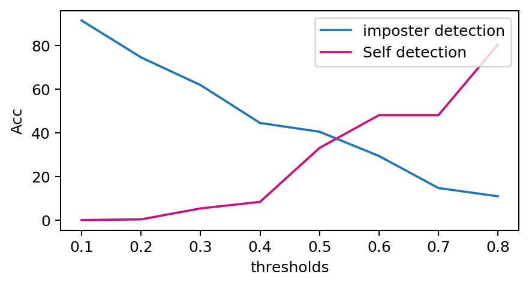
    


    <Figure size 432x288 with 0 Axes>


# OCSVM 


```python
from sklearn.svm import OneClassSVM
from sklearn.model_selection import cross_validate, RandomizedSearchCV
#Parameters to search 
param_dist = {"gamma": np.logspace(-3, 3), "nu": np.linspace(0.0001, 0.3)} 
#utility function to calculate err
utils_eer_scorer = make_scorer(utils_eer, greater_is_better=False)

samples_per_subject_train=50 #Samples for training 
samples_per_subject_test=50#samples for testing 
df_results = None  # Will be filled with randomsearch scores


#loop through all users and create training data for each user 
for df_cv_scenarios, owner, impostors in tqdm(
        utils_generate_cv_scenarios(
            df_siamese_val,
            samples_per_subject_train=samples_per_subject_train,
            samples_per_subject_test=samples_per_subject_test,
            deep_model=deep_feature_model,
            model_variant=model_variant,
        ),
        desc="Owner",
        total=df_siamese_train["subject"].nunique(),
        leave=False,
    ):
        X = np.array(df_cv_scenarios["X"].values.tolist())
        y = df_cv_scenarios["label"].values
        SEED=2020


        train_valid_cv = utils_create_cv_splits(df_cv_scenarios["mask"].values, SEED)

        model = OneClassSVM(kernel="rbf")

        warnings.filterwarnings("ignore")
        random_search = RandomizedSearchCV(
            model,
            param_distributions=param_dist,
            cv=train_valid_cv,
            n_iter=50,
            refit=False,
            scoring={"eer": utils_eer_scorer, "accuracy": "accuracy"},
            verbose=0,
            return_train_score=False,
            iid=False,
            error_score=np.nan,
            random_state=SEED,
        )

        random_search.fit(X, y)


        df_report = utils_cv_report(random_search, owner, impostors)
        df_results = pd.concat([df_results, df_report], sort=False)
df_results.to_csv(f"random_search_results_{window_size}_{model_variant}.csv", index=False)

```


    HBox(children=(FloatProgress(value=0.0, description='Owner', max=10.0, style=ProgressStyle(description_width='…


```python
print("Best results for each owner:")

display(
    df_results[df_results["rank_test_eer"] <= 1][
        [
            "owner",
            "param_nu",
            "param_gamma",
            "rank_test_eer",
            "mean_test_eer",
            "std_test_eer",
            "mean_test_accuracy",
            "std_test_accuracy",
        ]
    ].sort_values("mean_test_eer").head(10)
)

print("\n\n\nMost relevant statistics:")
display(
    df_results[df_results["rank_test_eer"] <= 1][
        [
            "mean_fit_time",
            "param_nu",
            "param_gamma",
            "mean_test_accuracy",
            "std_test_accuracy",
            "mean_test_eer",
            "std_test_eer",
        ]
    ].describe()
)
# utils_plot_randomsearch_results(df_results, 1)
fig,nu,gamma=utils_plot_randomsearch_results(df_results, 5)
print(f'NU: {nu}\nGamma: {gamma}')
utils_save_plot(fig,f"random_search_results_{window_size}_{model_variant}_{hmog}.png")
```

    Best results for each owner:
    


<div>
<style scoped>
    .dataframe tbody tr th:only-of-type {
        vertical-align: middle;
    }

    .dataframe tbody tr th {
        vertical-align: top;
    }

    .dataframe thead th {
        text-align: right;
    }
</style>
<table border="1" class="dataframe">
  <thead>
    <tr style="text-align: right;">
      <th></th>
      <th>owner</th>
      <th>param_nu</th>
      <th>param_gamma</th>
      <th>rank_test_eer</th>
      <th>mean_test_eer</th>
      <th>std_test_eer</th>
      <th>mean_test_accuracy</th>
      <th>std_test_accuracy</th>
    </tr>
  </thead>
  <tbody>
    <tr>
      <th>2</th>
      <td>201848</td>
      <td>0.0857857</td>
      <td>4.71487</td>
      <td>1.0</td>
      <td>0.047016</td>
      <td>0.017885</td>
      <td>0.970000</td>
      <td>0.016997</td>
    </tr>
    <tr>
      <th>33</th>
      <td>218719</td>
      <td>0.0368224</td>
      <td>14.5635</td>
      <td>1.0</td>
      <td>0.141230</td>
      <td>0.095271</td>
      <td>0.901111</td>
      <td>0.088248</td>
    </tr>
    <tr>
      <th>46</th>
      <td>220962</td>
      <td>0.030702</td>
      <td>59.6362</td>
      <td>1.0</td>
      <td>0.150342</td>
      <td>0.047479</td>
      <td>0.892222</td>
      <td>0.052868</td>
    </tr>
    <tr>
      <th>24</th>
      <td>207969</td>
      <td>0.104147</td>
      <td>2.6827</td>
      <td>1.0</td>
      <td>0.154520</td>
      <td>0.108288</td>
      <td>0.874444</td>
      <td>0.099232</td>
    </tr>
    <tr>
      <th>0</th>
      <td>151985</td>
      <td>0.116388</td>
      <td>0.00308884</td>
      <td>1.0</td>
      <td>0.155004</td>
      <td>0.186529</td>
      <td>0.871111</td>
      <td>0.169669</td>
    </tr>
    <tr>
      <th>20</th>
      <td>219303</td>
      <td>0.0613041</td>
      <td>10.9854</td>
      <td>1.0</td>
      <td>0.162181</td>
      <td>0.105851</td>
      <td>0.877778</td>
      <td>0.097727</td>
    </tr>
    <tr>
      <th>27</th>
      <td>180679</td>
      <td>0.0368224</td>
      <td>1.1514</td>
      <td>1.0</td>
      <td>0.194432</td>
      <td>0.181409</td>
      <td>0.834444</td>
      <td>0.173276</td>
    </tr>
    <tr>
      <th>4</th>
      <td>171538</td>
      <td>0.177592</td>
      <td>0.00175751</td>
      <td>1.0</td>
      <td>0.215197</td>
      <td>0.183982</td>
      <td>0.807778</td>
      <td>0.175168</td>
    </tr>
    <tr>
      <th>32</th>
      <td>100669</td>
      <td>0.0857857</td>
      <td>0.00232995</td>
      <td>1.0</td>
      <td>0.215919</td>
      <td>0.138854</td>
      <td>0.820000</td>
      <td>0.125963</td>
    </tr>
    <tr>
      <th>36</th>
      <td>186676</td>
      <td>0.140869</td>
      <td>19.307</td>
      <td>1.0</td>
      <td>0.244779</td>
      <td>0.101600</td>
      <td>0.801111</td>
      <td>0.112787</td>
    </tr>
  </tbody>
</table>
</div>


    
    
    
    Most relevant statistics:
    


<div>
<style scoped>
    .dataframe tbody tr th:only-of-type {
        vertical-align: middle;
    }

    .dataframe tbody tr th {
        vertical-align: top;
    }

    .dataframe thead th {
        text-align: right;
    }
</style>
<table border="1" class="dataframe">
  <thead>
    <tr style="text-align: right;">
      <th></th>
      <th>mean_fit_time</th>
      <th>mean_test_accuracy</th>
      <th>std_test_accuracy</th>
      <th>mean_test_eer</th>
      <th>std_test_eer</th>
    </tr>
  </thead>
  <tbody>
    <tr>
      <th>count</th>
      <td>10.000000</td>
      <td>10.000000</td>
      <td>10.000000</td>
      <td>10.000000</td>
      <td>10.000000</td>
    </tr>
    <tr>
      <th>mean</th>
      <td>0.001900</td>
      <td>0.865000</td>
      <td>0.111194</td>
      <td>0.168062</td>
      <td>0.116715</td>
    </tr>
    <tr>
      <th>std</th>
      <td>0.000281</td>
      <td>0.051289</td>
      <td>0.052401</td>
      <td>0.054942</td>
      <td>0.057264</td>
    </tr>
    <tr>
      <th>min</th>
      <td>0.001612</td>
      <td>0.801111</td>
      <td>0.016997</td>
      <td>0.047016</td>
      <td>0.017885</td>
    </tr>
    <tr>
      <th>25%</th>
      <td>0.001714</td>
      <td>0.823611</td>
      <td>0.090618</td>
      <td>0.151387</td>
      <td>0.096854</td>
    </tr>
    <tr>
      <th>50%</th>
      <td>0.001856</td>
      <td>0.872778</td>
      <td>0.106009</td>
      <td>0.158593</td>
      <td>0.107070</td>
    </tr>
    <tr>
      <th>75%</th>
      <td>0.001925</td>
      <td>0.888611</td>
      <td>0.158743</td>
      <td>0.210005</td>
      <td>0.170770</td>
    </tr>
    <tr>
      <th>max</th>
      <td>0.002587</td>
      <td>0.970000</td>
      <td>0.175168</td>
      <td>0.244779</td>
      <td>0.186529</td>
    </tr>
  </tbody>
</table>
</div>


    NU: 0.07966530612244899
    Gamma: 3.6987810793685596
    


    

    


```python

#utility function to calculate err
utils_eer_scorer = make_scorer(utils_eer, greater_is_better=False)

samples_per_subject_train=2000#Samples for training 
samples_per_subject_test=400#samples for testing 
df_results_eval = None  # Will be filled with randomsearch scores


#loop through all users and create training data for each user 
for df_cv_scenarios, owner, impostors in tqdm(
        utils_generate_cv_scenarios(
            df_siamese_val,
            samples_per_subject_train=samples_per_subject_train,
            samples_per_subject_test=samples_per_subject_test,
            deep_model=deep_feature_model,
            model_variant=model_variant,
        ),
        desc="Owner",
        total=df_siamese_train["subject"].nunique(),
        leave=False,
    ):
        X = np.array(df_cv_scenarios["X"].values.tolist())
        y = df_cv_scenarios["label"].values
        SEED=2020


        train_valid_cv = utils_create_cv_splits(df_cv_scenarios["mask"].values, SEED)

        model = OneClassSVM(kernel="rbf", nu=nu, gamma=gamma)

        warnings.filterwarnings("ignore")
        scores = cross_validate(
            model,
            X,
            y,
            cv=train_valid_cv,
            scoring={"eer": utils_eer_scorer, "accuracy": "accuracy"},
            verbose=0,
            return_train_score=True,
        )


        df_score = pd.DataFrame(scores)
        df_score["owner"] = owner
        df_score["train_eer"] = df_score["train_eer"].abs()  # Revert scorer's signflip
        df_score["test_eer"] = df_score["test_eer"].abs()
        df_results_eval = pd.concat([df_results_eval, df_score], axis=0)
df_results_eval.to_csv(f"random_search_results_eval_{window_size}_{model_variant}_{hmog}.csv", index=False)

```


    HBox(children=(FloatProgress(value=0.0, description='Owner', max=10.0, style=ProgressStyle(description_width='…


```python

```


```python
def utils_plot_acc_eer_dist(df_plot, y_col):
    n_subject = len(df_plot["Owner"].unique()) - 1
    mean_col = df_plot[y_col].mean()

    fig = plt.figure(figsize=(5.473, 2), dpi=180)
    ax = sns.boxplot(x="Owner", y=y_col, data=df_plot, **utils_boxplot_style)
    ax.set_ylim((0, 1))

    plt.plot(
        [-0.6, n_subject + 0.6],
        [mean_col, mean_col],
        linestyle="dashed",
        linewidth=1,
        color=MAGENTA,
        alpha=0.7,
    )
    plt.text(n_subject + 0.6, mean_col, f"mean", fontsize=6, color=MAGENTA)
    plt.text(
        n_subject + 0.6, mean_col - 0.04, f"{mean_col:.3f}", fontsize=4.5, color=MAGENTA
    )
    plt.xticks(rotation=45)
    fig.tight_layout()
    
    print(f"Overall mean: {mean_col:.4f}")
    return fig
# Define a style I use a lot for boxplots:
utils_boxplot_style = dict(
    color="tab:blue",
    linewidth=0.5,
    saturation=1,
    width=0.7,
    flierprops=dict(
        marker="o", markersize=2, markerfacecolor="none", markeredgewidth=0.5
    ),
)
# print(df_results.head())
df_plot = df_results_eval.rename(
    columns={"test_accuracy": "Test Accuracy", "test_eer": "Test EER", "owner": "Owner"}
).astype({"Owner": str})
fig = utils_plot_acc_eer_dist(df_plot, "Test Accuracy")
utils_save_plot(fig,f"OCSVM_EVAL_{window_size}_{model_variant}_{hmog}.png")
fig = utils_plot_acc_eer_dist(df_plot, "Test EER")

```

    Overall mean: 0.8304
    Overall mean: 0.1983
    


    
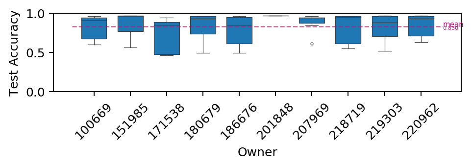
    


    
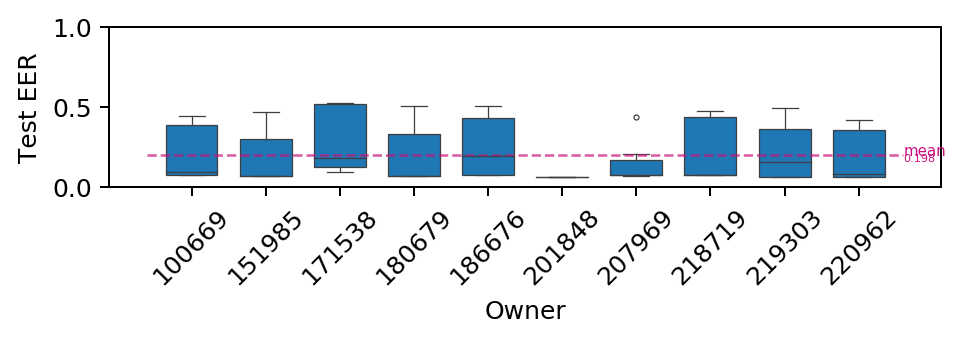
    

